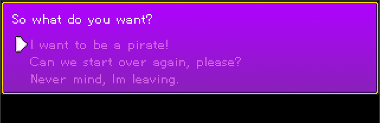
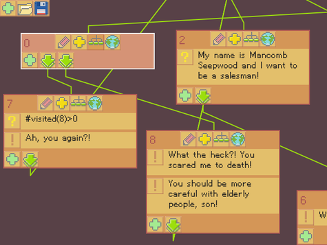

# Verbal 
Verbal is a node-based conversation tool. I could not find a simple, flexible, open conversation tool, so I made one myself. It is meant to be a simple tool for gamejams and smaller projects.


### How it works ###

Use the [editor](http://jarnik.itch.io/verbal) to create the conversation and export it to a JSON file like this:
```json
[
   {"actions":["So what do you want?"],"id":1,"links":[2,3],"x":336,"y":6},
   {"conds":["I want to be a pirate!"],"id":2,"links":[6],"x":280,"y":284},
   {"conds":["Never mind, Im leaving."],"id":3,"x":917,"y":318}
]
```
Then load the JSON into your game using the library (see the examples) or just interpret the data any way you need.

### Library platforms ###

Supported: OpenFL

Planned: HaxeFlixel, Unity, ? LOVE, ? GameMaker

Conversation tree example:



### Editor ###

Get it here (**Linux, Windows, Flash**): http://jarnik.itch.io/verbal


