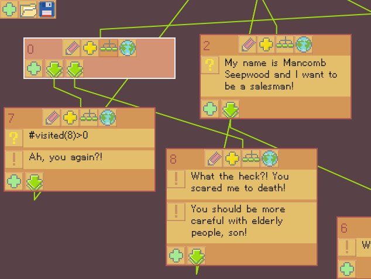

# Verbal
node-based conversation tool

```json
[
   {"actions":["What the heck?! You scared me to death!"],"id":0,"links":[1,2,-1],"x":55,"y":78},
   {"conds":["My name is Mancomb Seepwood and I want to be a salesman!"],"id":1,"x":58,"y":256},
   {"conds":["I am looking for a nearest treasure. Seen any lately?"],"id":2,"x":58,"y":457},
   {"conds":["Can you teach me how to use a sword? "],"id":3,"x":297,"y":256}
]
```

### How it works ###

Use the editor to create the conversation and export it to a JSON file.
Then load the JSON into your game using the library.
It's up to you to interpret the data, but there are some examples that you can use as a base: Conversation tree, Interactive fiction.

### Library platforms ###

Supported: OpenFL

Planned: HaxeFlixel, Unity, ? LOVE, ? GameMaker

screenshot - example tree dialogue

### Editor (alpha) ###



Get it here (*Linux*, *Windows*, *Flash*):
* http://itch.io
* http://gamejolt.io
